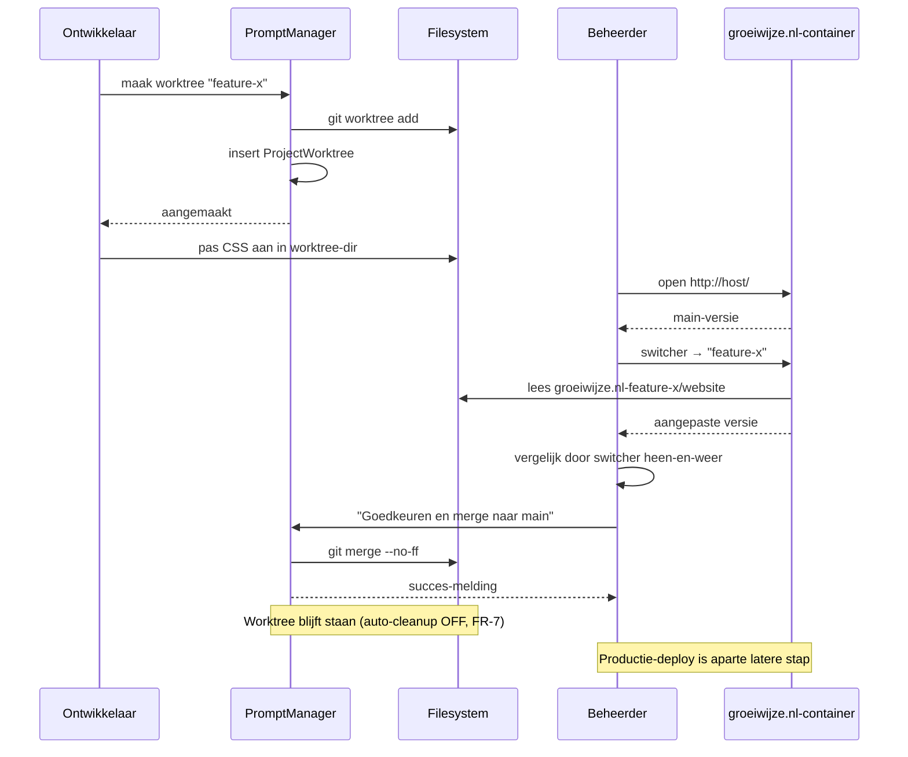
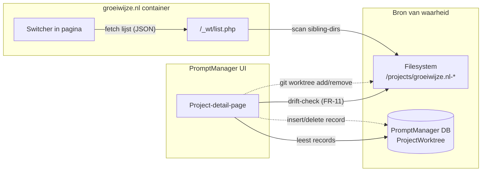

# Analyse — Worktrees voor groeiwijze.nl

> **Status:** Functionele analyse (niet-implementatiegericht). Voor de aanpassingen aan PromptManager-zijde, zie het zusterdocument `/var/www/worktree/main/.ai/features/groeiwijze-worktrees/analysis.md`.

## 1. Doel

Maak het mogelijk om wijzigingen aan groeiwijze.nl te beproeven in een **parallelle git-worktree**, naast de productieversie van `master` (verder "main" genoemd voor consistentie met PromptManager-terminologie). Eindgebruiker is **niet-technisch**: één URL, geen handmatige Docker- of git-commando's, robuust bij fouten.

De drie kerncapaciteiten:

1. **Beproeven** — een wijziging veilig isoleren in een eigen branch + directory zonder de main-versie te raken.
2. **Vergelijken** — main en de worktree naast elkaar in de browser kunnen openen, met main als default-bestemming.
3. **Analyseren** — de wijzigingen door één of meer rol-prompts (UI, SEO, accessibility, content-toon) laten beoordelen en de uitkomst terugkoppelen naar de worktree.

## 2. Scope

| Behandeld | Niet behandeld |
|-----------|----------------|
| Worktree-lifecycle voor een statische site (HTML/CSS/JS + één PHP-form) | Multi-tenant productie-deploy (worktrees zijn dev-only) |
| Browser-routering naar worktrees via één URL | Geautomatiseerde visuele diff-tooling |
| Edge cases rond verwijderde branches, ontbrekende directories, `private/` en `.env` | Database-isolatie van groeiwijze.nl-zelf (site is stateless). PromptManager-pipeline ondersteunt DB-isolatie wel als capability voor andere stacks — zie zusterdoc §4 + roadmap |
| Trigger-pad voor rol-analyse als vervolgflow | Volledige rol-prompt-implementatie (zie open punten) |
| Routerings-infrastructuur (mount-strategie, nginx, switcher-lijst-mechanisme) | Per-worktree afwijkende SMTP-config (vereist eigen container per worktree) |

## 3. Stakeholders

| Rol | Pijn vandaag | Wat de feature levert | Success-metric |
|-----|--------------|----------------------|----------------|
| **Beheerder** (niet-technisch) | Wijzigingen aan de site kunnen pas beoordeeld worden nadat ze in main staan; geen veilige tussenstap, geen vergelijkbare baseline | URL-driven vergelijking; klikbare switcher; merge-besluit zonder terminal | Aandeel wijzigingen via "worktree-vergelijking → goedgekeurd" t.o.v. "blind naar main" / kwartaal |
| **Ontwikkelaar / AI-agent** | Beheerder ziet branch-based wijzigingen niet; reviews via screenshots zijn arm en handmatig | Worktree maken = beheerder kan direct meekijken; rol-analyse-skill = geautomatiseerde 2nd opinion | Doorlooptijd "wijziging klaar" → "beslissing genomen" / iteratie |
| **Bezoeker (productie)** | n.v.t. | Geen — productie blijft single-container, single-branch | n.v.t. |

## 4. Domeinconcepten

| Term | Betekenis |
|------|-----------|
| **Main** | De directory `/projects/groeiwijze.nl` op branch `master`. Default-doel in de browser. |
| **Worktree** | Een sibling-directory `/projects/groeiwijze.nl-<suffix>` op een eigen branch, gekoppeld aan dezelfde git-repo. |
| **`?wt=<suffix>`** | URL-parameter die de webserver vertelt welke worktree-directory hij als document root moet gebruiken. Geen parameter = main. |

## 5. Functionele requirements

### FR-1 — Worktree aanmaken
**Wat** — Een nieuwe worktree wordt aangemaakt door een branchnaam op te geven; de webserver moet die direct kunnen serveren zonder herstart.
**Waarom** — Niet-technische beheerder mag geen Docker-restart hoeven uitvoeren.
**Hoe te valideren** — Direct na aanmaken levert `http://<host>/?wt=<suffix>` een volledige pagina op uit de nieuwe directory.

### FR-2 — Main als default
**Wat** — Een URL zonder `?wt=` parameter serveert altijd main.
**Waarom** — De beheerder verwart "geen keuze" niet met een willekeurige worktree.
**Hoe te valideren** — `http://<host>/` toont main, ongeacht hoeveel worktrees bestaan.

### FR-3 — Switcher in de pagina
**Wat** — Elke pagina (zowel in main als in elke worktree) toont een switcher waarmee tussen actieve worktrees gewisseld kan worden.
**Waarom** — Beheerder vergelijkt vanuit de browser, niet vanuit een terminal.
**Hoe te valideren** — Op elke `.html`-pagina staat de switcher zichtbaar; de huidige selectie is gemarkeerd; klikken op een andere optie laadt dezelfde pagina in die worktree.

### FR-4 — Robuuste fallback bij ontbrekende worktree
**Wat** — Als `?wt=<suffix>` verwijst naar een directory die niet (meer) bestaat, valt de webserver terug op main in plaats van een 404 te tonen.
**Waarom** — Stale bookmark of verwijderde worktree mag de beheerder niet stranden.
**Hoe te valideren** — `http://<host>/?wt=bestaat-niet` toont main + een waarschuwing in de switcher dat de gevraagde worktree niet bestaat.

### FR-5 — Lijst beschikbare worktrees
**Wat** — De switcher haalt zijn opties uit een endpoint dat de actuele worktrees inventariseert (sibling-directories met geldig git-worktree-record).
**Waarom** — Geen handmatige lijst-onderhoud; nieuwe worktrees verschijnen automatisch.
**Hoe te valideren** — Direct na het aanmaken van een worktree verschijnt deze in de switcher zonder pagina-refresh-config.

### FR-6 — Worktree verwijderen
**Wat** — Een worktree verwijderen veegt zowel de directory, het git-worktree-record als (optioneel) de branch op.
**Waarom** — Anders ontstaan orphans die de switcher vervuilen of disk vol laten lopen.
**Hoe te valideren** — Na verwijdering verdwijnt de worktree uit de switcher en is de directory weg; main is onaangetast.

### FR-7 — Wijzigingen samenvoegen of verwerpen
**Wat** — Een afgeronde worktree-aanpassing kan terug-gemerged worden naar main; alternatief: worktree wordt verwijderd zonder merge.
**Waarom** — Functionele uitkomst van het beproefen.
**Hoe te valideren** — Na merge zit de wijziging in main; bij verwerpen is main ongewijzigd en is de worktree weg.

### FR-8 — Trigger voor rol-analyse (vervolgflow)
**Wat** — Iteratie 1: een skill/command waarmee de niet-technische beheerder (a) één of meer rollen selecteert (multi-select), (b) twee bestaande worktrees opgeeft als vergelijkingsbasis (één is meestal main). De skill produceert per gekozen rol een rapport over de delta tussen die twee worktrees.
**Waarom** — Onderdeel van de werkflow "wijziging → vergelijken → laten beoordelen → besluiten". Skill-vorm houdt iteratie 1 klein en kopieerbaar; rijkere triggers (UI-knop, screenshots, lighthouse, async) zijn vervolg.
**Hoe te valideren** — Skill is invokeerbaar zonder dat de gebruiker een bestand of branchnaam hoeft te onthouden — rol-keuze en worktree-keuze zijn klikbaar / kopieerbare lijstjes. Output is een md-rapport per rol per vergelijking.

### Iteratie-prioritering

| Prioriteit iteratie 1 | FR's |
|----------------------|------|
| **MUST** | FR-1 t/m FR-7 — worktrees werkend in browser, vergelijkbaar via switcher, mergeable terug |
| **SHOULD** | — |
| **COULD / iteratie 2** | FR-8 (rol-analyse-trigger) — vervolgflow zodra iteratie 1 bewezen werkt |

Reden: iteratie 1 levert de gebruikswaarde "beproeven en goedkeuren" volledig zonder rol-analyse; FR-8 vergroot de waarde maar is niet voorwaardelijk.

## 6. Niet-functionele requirements

| NFR | Eis |
|-----|-----|
| **Eenvoud** | Beheerder bezoekt één URL en gebruikt dropdown/switcher. Geen IDE, geen terminal, geen DNS-config. |
| **Robuustheid** | Stale of corrupte worktree mag main-flow niet breken. Server-restart is geen voorwaarde voor het zien van een nieuwe worktree. |
| **Transparantie** | De huidig getoonde worktree is altijd zichtbaar (badge/markering in de switcher). |
| **Veiligheid** | Worktree-suffix wordt strikt gevalideerd (whitelist `[a-zA-Z0-9_-]{1,100}`) om path-traversal te voorkomen. |
| **Geen prod-impact** | Mechanisme draait alleen in dev. Productie blijft single-container. |

## 7. Gebruikersflows

### Happy path A — Beproeven en goedkeuren

1. Ontwikkelaar maakt worktree aan: `feature-cta-rust` → directory `/projects/groeiwijze.nl-feature-cta-rust` op branch `feature-cta-rust`.
2. Ontwikkelaar past CSS aan in de worktree-directory.
3. Beheerder opent `http://<host>/`, ziet main; klikt in switcher op "feature-cta-rust"; ziet aangepaste CTA.
4. Beheerder vergelijkt door switcher heen-en-weer te schakelen op dezelfde pagina.
5. Beheerder keurt goed via PromptManager-UI ("Goedkeuren en merge naar main"); worktree blijft bestaan tot expliciet verwijderd.
6. Productie-deploy is een aparte latere stap door ontwikkelaar.

### Happy path B — Beproeven en verwerpen

1. Idem stap 1-4.
2. Beheerder keurt af.
3. Ontwikkelaar verwijdert de worktree zonder merge; branch wordt eveneens opgeruimd.
4. Main is ongewijzigd.

### Happy path C — Rol-analyse als tussenstap

1. Ontwikkelaar maakt worktree + wijziging.
2. Niet-tech beheerder of ontwikkelaar triggert rol-analyse-skill: kiest rollen (multi-select) + twee worktrees (meestal main + worktree-X).
3. Skill produceert per rol een md-rapport over de delta.
4. Ontwikkelaar verwerkt feedback in dezelfde worktree.
5. Vervolg → Happy path A of B.

### Sequence-overzicht — Happy path A

## 8. Edge cases

| Scenario | Verwacht gedrag |
|----------|----------------|
| `?wt=` verwijst naar verwijderde worktree | Fallback naar main + zichtbare melding in switcher (FR-4) |
| Twee worktrees met identieke suffix | Aanmaken van de tweede faalt met duidelijke foutmelding; uniqueness op `path_suffix` |
| Branchnaam met `/` of `.` (bv. `feature/cta`) | Suffix wordt gesanitized (`/` en `.` → `-`); branch behoudt originele naam |
| Beheerder bookmarkt `?wt=foo` en de worktree wordt later gemerged + verwijderd | Bookmark valt terug op main (FR-4) — geen 404 |
| Wijziging in `private/` directory in worktree | Geen functionele impact — runtime gebruikt container's gegenereerde config (zie §10), niet `private/` uit de worktree |
| Worktree heeft eigen `.env` (afwijkende SMTP-config) | Geen functionele impact in single-container architectuur — runtime gebruikt env-vars die uit main's `.env` zijn geladen bij container-start |
| `contact-submit.php` in worktree afwijkend | Geen functionele impact — runtime gebruikt de docker-bakte versie. Wijzigingen aan de PHP-handler vereisen image-rebuild |
| Worktree-directory bestaat maar git-worktree-record niet (corrupt) | Niet zichtbaar in switcher; opruim-actie nodig (vergelijkbaar met PromptManager's `actionCleanup`) |
| Beheerder heeft pagina open in worktree-A; ontwikkelaar verwijdert worktree-A | Volgende klik valt terug op main (FR-4); switcher refresh toont actuele lijst |
| Caching van assets door browser bij switchen tussen worktrees | Opgelost via `Cache-Control: no-store` op asset-responses in `?wt=`-context |
| Path-traversal poging via `?wt=../etc` | Whitelist-regex in nginx-`map` weigert; pad valt terug op main |
| `?wt=` met geldige suffix maar dir buiten groeiwijze.nl-namespace | Niet bereikbaar — nginx-`map` construeert pad als `groeiwijze.nl-<suffix>`, andere prefixes nooit |
| main's `.env` wijzigt (nieuwe SMTP-credentials) | Container-restart nodig om nieuwe waarden te laden — geldt zowel main als alle worktrees gelijktijdig |

## 9. Acceptatiecriteria

- [ ] **AC-1** — Een net-aangemaakte worktree is binnen 5 seconden bereikbaar via `?wt=<suffix>` zonder docker-compose restart.
- [ ] **AC-2** — `http://<host>/` zonder parameter toont altijd main.
- [ ] **AC-3** — De switcher verschijnt op elke HTML-pagina van zowel main als elke worktree, zonder de bestaande pagina-layout te breken.
- [ ] **AC-4** — `?wt=onbestaand` levert main + zichtbare melding ("worktree 'onbestaand' niet gevonden — main getoond"), geen 404.
- [ ] **AC-5** — Een verwijderde worktree verdwijnt binnen één pagina-refresh uit de switcher.
- [ ] **AC-6** — Path-traversal pogingen (`?wt=../etc`) worden geweigerd; de map valt terug op main.
- [ ] **AC-7** — `private/`-directory blijft in elke worktree onbereikbaar via web (bestaande nginx-block geldt onder elke document-root).
- [ ] **AC-8** — Form-submit op `contact.html` in een worktree gebruikt de container's gegenereerde mail-config; resultaat is identiek tussen main en worktree.
- [ ] **AC-9** — Verwijderen van een worktree breekt main niet en laat geen orphan-branches achter.
- [ ] **AC-10** — Rol-analyse-skill accepteert (rol-multi-select, source-worktree, target-worktree); produceert per rol een md-rapport.
- [ ] **AC-11** — Asset-responses in worktree-context (`?wt=` aanwezig) bevatten `Cache-Control: no-store`; in main-context blijven ze `public, immutable`.
- [ ] **AC-12** — Goedkeuren-en-merge-actie via PromptManager-UI mergt worktree-branch naar main; worktree blijft bestaan na merge (auto-cleanup OFF); productie-deploy is expliciet daarna pas.

## 10. Routerings-infrastructuur

> **Status:** Implementatie-richtlijn — geen functionele requirement. Onderstaande mount-strategie, nginx-aanpassingen en switcher-mechanismen realiseren FR-1 t/m FR-5 + FR-11 (drift-detectie). Alternatieve implementaties die dezelfde requirements halen zijn toegestaan.

### State-bron-architectuur

**Lezing:** PromptManager-UI heeft de DB als primaire bron en checkt het filesystem voor drift. groeiwijze.nl-switcher heeft het filesystem als enige bron — geen netwerk-koppeling met PromptManager. Het filesystem is de gedeelde grond; beide systemen schrijven en lezen onafhankelijk.

### Mount-strategie

| Was | Wordt |
|-----|-------|
| `./website:/var/www/html:ro` | `/projects:/var/www/projects:ro` |

Container krijgt read-only mount van `/projects/`. Nginx in container construeert document-roots binnen het `groeiwijze.nl*`-namespace via `?wt=`-mapping. Andere directories onder `/projects/` zijn nooit bereikbaar — nginx-whitelist construeert geen paden buiten het toegestane namespace.

**Security-trade-off bewust geaccepteerd:** read-only mount + nginx-whitelist + PHP-execution-block in dev-context acceptabel. Bij multi-tenant-overweging: herzien (richting symlink-tree).

### Nginx-aanpassingen

| Onderdeel | Functie |
|-----------|---------|
| `map $arg_wt $wt_root` | `default → groeiwijze.nl`; gevalideerde suffix → `groeiwijze.nl-<suffix>` |
| `root $wt_root/website;` | Vervangt vaste `root /var/www/html` |
| `try_files` met fallback naar main-pad | FR-4 |
| `sub_filter '</body>'` met switcher-script | FR-3 |
| `if ($arg_wt) { add_header Cache-Control "no-store"; }` op assets | AC-11 |
| `location = /_wt/list` | Switcher-lijst-endpoint (FR-5) |
| `location = /_wt/switcher.js` | Statische switcher-widget |
| `location ~ /private/` | Bestaande deny-block, blijft gelden onder elke document-root |

Suffix-whitelist: regex `^[a-zA-Z0-9_-]{1,100}$` in `map`. Bij ongeldige suffix valt nginx terug op default (main).

### Switcher-lijst-mechanisme

Klein PHP-script `/_wt/list.php` scant `groeiwijze.nl-*` sibling-dirs en geeft JSON terug. Bron = filesystem (niet PromptManager-DB):
- Switcher werkt zelfstandig, ook als PromptManager down is.
- Geen netwerk-coupling tussen containers.
- Drift-detectie tussen DB en filesystem ligt in PromptManager-UI (zie zusterdoc FR-11), niet hier.

Handmatig aangemaakte directory verschijnt automatisch; PromptManager biedt "Importeer onbekende worktree" aan in zijn UI.

### Container-runtime gevolgen

| Aspect | Gevolg |
|--------|--------|
| Env-vars (SMTP, RATE_LIMIT_SALT) | Geladen uit main's `.env` bij container-start; gedeeld tussen alle worktrees |
| Gegenereerde mail-config | Eénmalig door entrypoint geschreven; gedeeld tussen alle worktrees |
| `contact-submit.php` runtime | Docker-bakte versie; worktree-versie wordt niet uitgevoerd |
| Wijziging aan main's `.env` | Vereist container-restart |
| Per-worktree afwijkende SMTP-config | Niet mogelijk (vereist eigen container per worktree — buiten scope) |

### Productie-impact

Geen. Productie-deploy gebruikt eigen `docker-compose.yml` met de oude single-website-mount; geen `?wt=`, geen switcher.

## 11. Open punten

| # | Punt | Beslissing |
|---|------|-----------|
| 1 | Vorm rol-analyse-trigger | Iteratie 1: skill/command met rol-multi-select + 2 worktrees, output md-rapport per rol. Verfijning (UI-knop, screenshots, lighthouse, async) is iteratie 2. |
| 2 | Cache-buster per worktree | Nginx voegt `Cache-Control: no-store` toe aan asset-responses bij `?wt=`. Main behoudt `public, immutable`. Productie ongeraakt. |
| 3 | `.env` strategie | Symlink op filesystem-niveau (consistent met PromptManager); geen runtime-effect in single-container. Mailbox-veiligheid via afzonderlijke `dev-mailcatcher`-feature. |
| 4 | Tailscale Serve | Geen filter. Tailscale-exposure (opt-in via commando uit `start-sites.sh`) toont alle worktrees + switcher op tailnet. Risico bewust geaccepteerd in single-user/vertrouwd-tailnet-context. Bij niet-tech bezoekers op tailnet: herzien. |
| 5 | Branch-naamgeving | Geen technische conventie. Sanitization volstaat. `WorktreePurpose`-enum blijft optioneel label. Herzien zodra niet-tech beheerder zelf worktrees aanmaakt via UI. |
| 6 | Lifecycle merge-back | Beheerder via PromptManager-UI ("Goedkeuren en merge naar main"). Auto-cleanup OFF: worktree blijft staan, verwijderen is aparte actie. Conflict-handling via bestaande pre-check; geen in-browser conflict-resolutie. |
| 7 | `screenshots/` directory | Niet aanraken. Bestaande directory-gedrag blijft. Herzien zodra rol-analyse screenshots gaat genereren. |

### Latere overwegingen

- **Wijziging aan `contact-submit.php` in worktree** — Niet zichtbaar in dev (docker-bakte versie wint). Vereist andere mount-strategie of image-rebuild-flow per worktree zodra non-tech beheerder PHP-handler-wijzigingen wil testen.
- **`/_wt/list.php` performance bij veel worktrees** — Eén filesystem-scan per pagina-laad; tot ~50 worktrees acceptabel.

## 12. Risico's

| Risico | Impact | Mitigatie |
|--------|--------|-----------|
| Beheerder verwart worktree-versie met productie | **Hoog** — beheerder neemt verkeerd besluit op basis van dev-data | Switcher toont prominente badge ("WORKTREE: <suffix>") in andere kleur dan main |
| Form-submit in worktree raakt productie-mailbox | **Hoog** — klant-impact mogelijk | Buiten scope — afgevangen door `dev-mailcatcher`-feature (zie cross-link §15) |
| Path-traversal via `?wt=` | **Hoog** — security | Whitelist-validatie in nginx `map`-directive |
| Onbedoelde merge naar main | **Middel** — recoverable via revert; verstoort wel ontwikkel-flow | Merge-back is expliciete UI-actie; "worktree weg" verwijdert alleen de worktree, niet de branch |
| Container heeft read-only mount van `/projects/` | **Middel** — leesbaarheid andere projecten in container; alleen relevant bij compromise | Beperkt door read-only + nginx-whitelist + PHP-execution-block. Bij multi-tenant: herzien |
| Wijziging aan `contact-submit.php` niet zichtbaar | **Laag** — bekend, geaccepteerd voor iteratie 1 | Image-rebuild voor PHP-handler-wijzigingen |
| Tailscale-bezoeker ziet onaffe worktree-content | **Laag** — single-user-context, opt-in via `start-sites.sh` | Geaccepteerd. Bij uitbreiding tailnet naar niet-developers: herzien |

## 13. Functionele grenzen tussen groeiwijze.nl en PromptManager

| Verantwoordelijkheid | Eigenaar |
|----------------------|----------|
| Worktree aanmaken / verwijderen / mergen (git-operaties) | PromptManager (`WorktreeService`) |
| Browser-routering (`?wt=`, switcher, fallback, lijst-endpoint) | groeiwijze.nl (eigen nginx + Docker-compose) |
| Setup-stappen ná `git worktree add` | PromptManager-recipe voor `static`-stack: leeg `[]` (zie zusterdoc §6). Geen per-worktree filesystem-setup |
| Docker-compose mount-strategie + nginx-config | groeiwijze.nl (zie §10) |
| Trigger rol-analyse | PromptManager (UI/CLI), input/output via worktree-directory |
| Status van setup en sync | PromptManager (`ProjectWorktree.setup_status`, `setup_failed_step`) |
| Goedkeuren-en-merge-knop | PromptManager-UI |

## 14. Feature-afhankelijkheden

**Deze feature hangt af van:**

| Afhankelijkheid | Verplicht / optioneel | Reden |
|-----------------|------------------------|-------|
| PromptManager composable-pipeline (zusterdoc fase 1-3) | Verplicht | Worktree-aanmaak voor `static`-stack vereist pipeline-engine met leeg-recipe-support |
| `dev-mailcatcher`-feature | Verplicht voor productie-veilige iteratie 1 | Zonder mailcatcher gaan form-submits in dev naar productie-SMTP — onacceptabel risico |

**Deze feature is voorwaarde voor:**

| Doel-feature | Status |
|--------------|--------|
| Rol-analyse-skill iteratie 2 (screenshots / lighthouse / async) | Toekomst — vereist werkende worktree-vergelijking als fundament |
| nginx-port-allocatie als alternatief routerings-mechanisme | Toekomst — eigen feature-analyse zodra opgepakt |

## 15. Cross-link

- PromptManager-zijde van deze feature: `/var/www/worktree/main/.ai/features/groeiwijze-worktrees/analysis.md`
- Implementatieplan: `/projects/groeiwijze.nl/.ai/features/worktrees/implementation-plan.md` (spiegel in PromptManager)
- Architectuurreferentie (Yii2-implementatie): `/var/www/worktree/main/docs/techdoc/worktree.md` + `worktree-details.md`
- Aanpalende feature (mailbox-veiligheid in dev): `/projects/groeiwijze.nl/.ai/features/dev-mailcatcher/analysis.md`
- Architectuur-precedent voor `?wt=`-routering: `/var/www/worktree/main/docker/nginx.conf.template`
